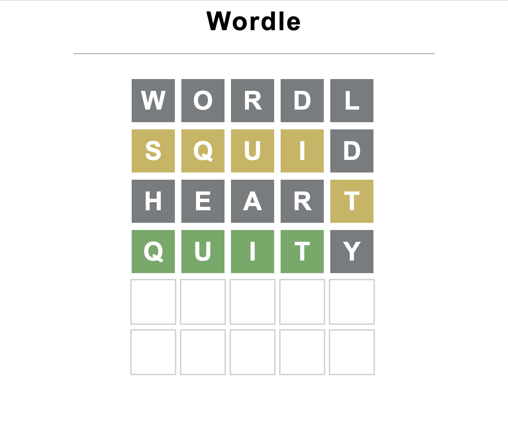

# Welcome to WordGuess Clone!

WordGuess Clone is a fun and addictive word-guessing game inspired by the popular game Wordle. Put your vocabulary and deduction skills to the test as you try to guess the secret word within a limited number of attempts.



## How to Play

1. **Objective**: Your goal is to guess the secret word, which is randomly chosen from a predefined list of words. The secret word is typically five letters long.

2. **Guessing**: On each turn, you can enter a five-letter word into the input field and submit your guess by pressing the "Guess" button. After each guess, you will receive feedback to help you narrow down the possibilities.

3. **Feedback**: The feedback consists of colored squares placed next to your guessed word:
   - A green square indicates that the letter is in the correct position.
   - A yellow square indicates that the letter is in the secret word but in a different position.
   - A gray square indicates that the letter is not in the secret word at all.

4. **Limited Attempts**: You have a limited number of attempts to guess the secret word. The exact number of attempts is displayed at the beginning of the game.

5. **Winning**: If you guess the secret word within the allowed attempts, you win the game! If not, don't worry – you can always start a new game and try again.

## Getting Started

### Option 1: To play WordGuess Clone online, follow these steps:

1. Open the https://oghosa.github.io/wordle-clone/ in your web browser.

3. Start guessing the secret word by entering five-letter words in the input field and clicking the "Guess" button.

### Option 2: To play WordGuess Clone on your local machine, follow these steps:

1. Clone this repository to your computer.
   ```
   git clone https://github.com/oghosa/wordle-clone.git
   ```

2. Open the index.html file in your web browser.

3. Start guessing the secret word by entering five-letter words in the input field and clicking the "Guess" button.

## Customization

You can easily customize WordGuess Clone to suit your preferences or add additional features:

- **Word List**: Modify the list of words from which the secret word is chosen. You can edit the `wordList` array in the `script.js` file.

- **Difficulty Levels**: Adjust the number of attempts allowed for guessing based on difficulty levels.

- **Styling**: Customize the game's appearance by modifying the CSS in the `wordle.css` file.

## Contributing

If you'd like to contribute to WordGuess Clone, feel free to fork this repository, make your changes, and submit a pull request. We welcome improvements, bug fixes, and new features!

## Credits

WordGuess Clone was created with ❤️ by Oghosa with help from Kenny Yip's Tutorial https://www.kennyyipcoding.com/. It was inspired by the original Wordle game.

## License

This project is licensed under the [MIT License](LICENSE).

Enjoy the game and happy guessing!
